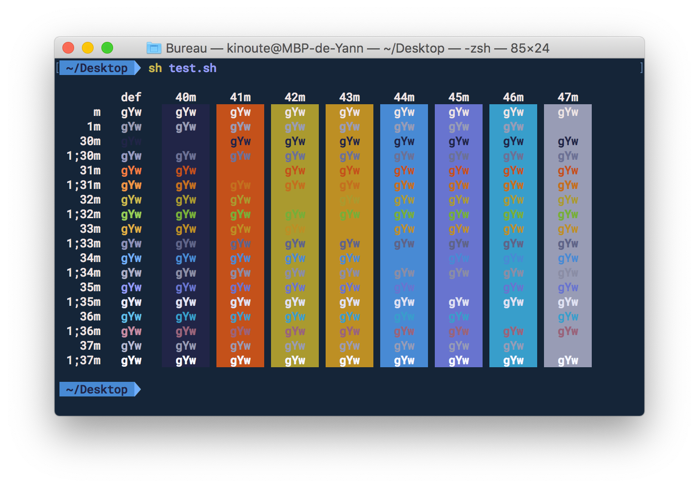
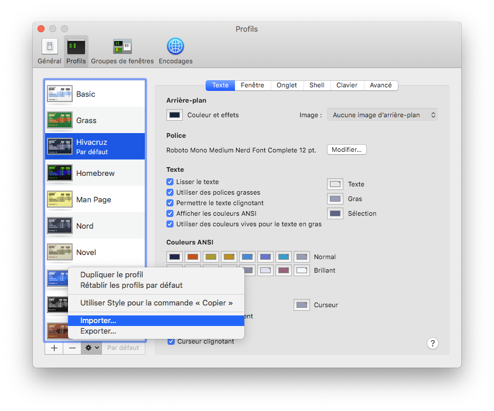
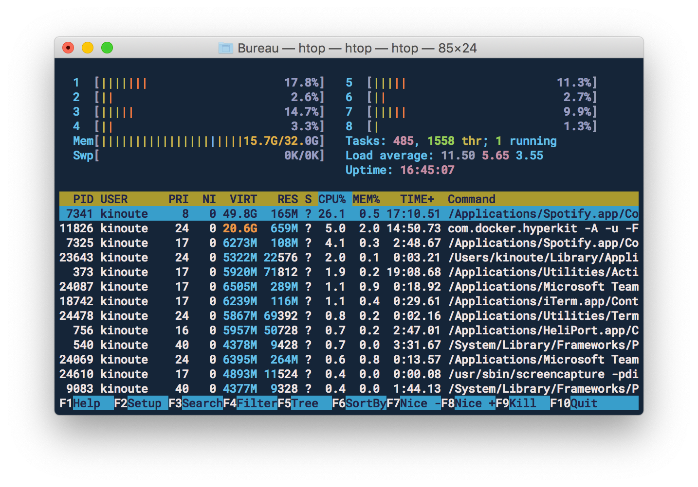

# Terminal App Hivacruz Theme

The _hivacruz_ dark blue color scheme, for Apple Terminal app.

> Font used: [Roboto Mono Medium Nerd Font Complete](https://github.com/ryanoasis/nerd-fonts/blob/master/patched-fonts/RobotoMono/Regular/complete/Roboto%20Mono%20Nerd%20Font%20Complete.ttf), 12px.

## Installation

Download the latest [Hivacruz.terminal](Hivacruz.terminal) file from the GitHub repository and import it:

1. Start `Terminal.app` and open the *Preferences*
2. Switch to the *Profiles* tab located in the topbar
3. Click on the gear icon and select the *Import*... entry
4. Import the downloaded `Hivacruz.terminal` file

## Screenshots

## Same theme for other apps

- Sublime Text theme: https://github.com/kinoute/hivacruz-sublime-theme
- VSCode Theme: https://github.com/kinoute/vscode-hivacruz-theme
- Vim Theme: https://github.com/kinoute/vim-hivacruz-theme
- iTerm2: https://github.com/kinoute/hivacruz-itermcolors
- Nova: https://github.com/kinoute/hivacruz-nova-theme
- Typora Theme: https://github.com/kinoute/typora-hivacruz-theme

## Credits

* Created by [Yann Defretin](https://github.com/kinoute).

